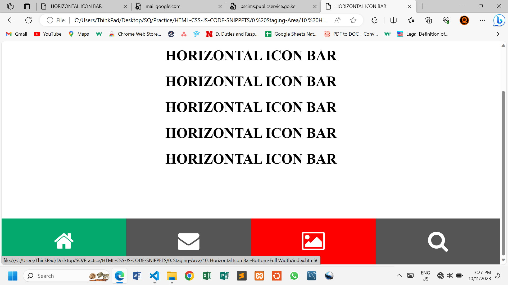
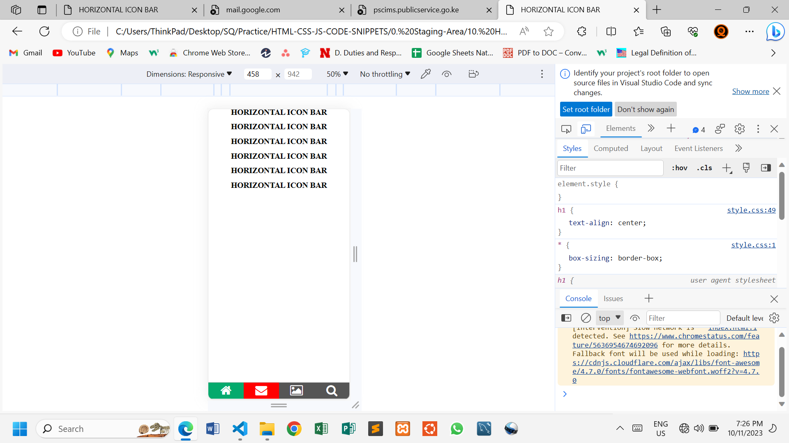

# HORIZONTAL BOTTOM ICON BAR

This simple web page demonstrates how to make a Responsive Horizontal Icon Bar using HTML and CSS.

## HTML Structure

The icons are imported from **font awesome** with a link placed in the header section of the HTML file.

```html
<head>
    <link rel="stylesheet" href="https://cdnjs.cloudflare.com/ajax/libs/font-awesome/4.7.0/css/font-awesome.min.css">
</head>
```

## CSS

A simple style is added to give the page a better look.

## Solution



### Break Point

A media query is used to lower the font sizes in smaller screens

```css
@media (max-width: 680px) {
    html {
        font-size: 13px;
    }

    .icon-bar a {
        padding: 0.1em 0;
    }
}
```



## Changes

Feel free to modify the HTML and CSS files to suit your needs.

## Author

SQCODES

## License

This project is free for use any where. You do not need to get any permission to use it.