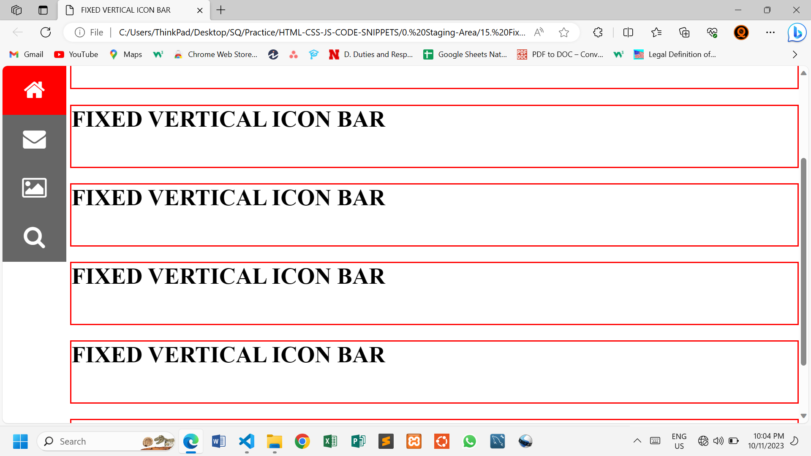

# FIXED VERTICAL ICON BAR LEFT

This simple web page demonstrates how to make a Responsive Vertical Icon Bar using HTML and CSS. The Bar will be fixed at the top left of the page.

## HTML Structure

The icons are imported from **font awesome** with a link placed in the header section of the HTML file.

```html
<head>
    <link rel="stylesheet" href="https://cdnjs.cloudflare.com/ajax/libs/font-awesome/4.7.0/css/font-awesome.min.css">
</head>
```

## CSS

A simple style is added to give the page a better look.

`position: fixed` to keep the bar fixed.

```css
    .icon-bar {
    background-color: var(--gray-color);
    width: 8%;
    position: fixed;
    top: 0;
}```

Bar items stack over each other with `display: block;`.

```css
    .icon-bar a {
    display: block;
    padding: .5em;
    color: var(--white-color);
    font-size: 2rem;
    text-align: center;
}
```

Add margin left to the h1 elements.

```css
    h1 {
    margin-left: 8.5%;
    height: 100px;
    border: 2px solid var(--active-color);
}
```

## Solution



### Break Point

A media query is used to lower the font sizes in smaller screens.

```css
@media (max-width: 720px) {
    html {
        font-size: 13px;
    }

    .icon-bar a {
        padding: 0.1em 0;
    }
}
```


## Changes

Feel free to modify the HTML and CSS files to suit your needs.

## Author

SQCODES

## License

This project is free for use any where. You do not need to get any permission to use it.