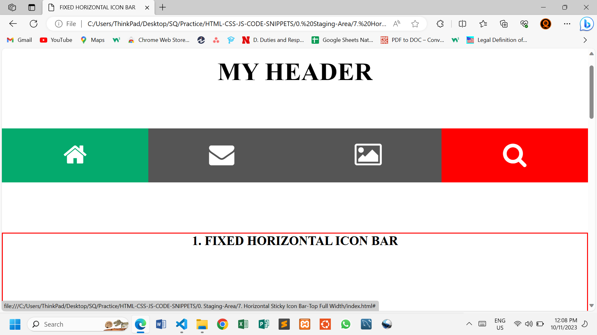
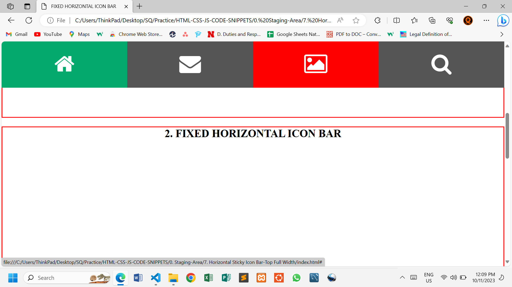
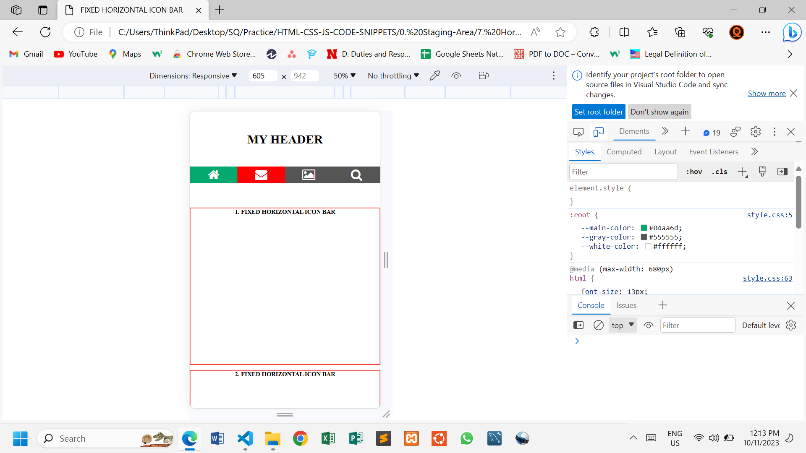
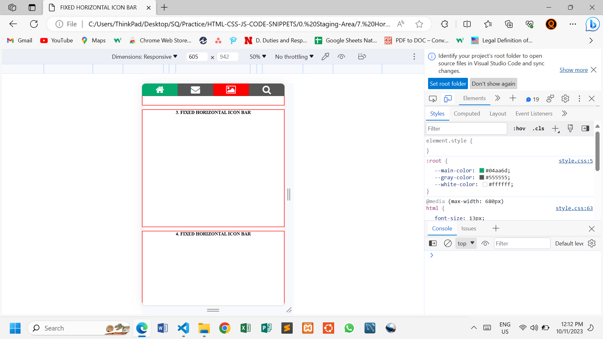

# STICKY TOP HORIZONTAL ICON BAR - FULL WIDTH

This simple web page demonstrates how to make a Responsive Horizontal Icon Bar using HTML and CSS.

## HTML Structure

The icons are imported from **font awesome** with a link placed in the header section of the HTML file.

The page has a header section with the icon bar bellow it. The icon bar will scroll up and stick at `top:0;`.

```html
<head>
    <link rel="stylesheet" href="https://cdnjs.cloudflare.com/ajax/libs/font-awesome/4.7.0/css/font-awesome.min.css">
</head>
```

## CSS

A simple style is added to give a better look.

We add `position: sticky;` and `top: 0;` so that the icon bar scrolls up and sticks at the top of the page. When the page scrolls down, the icon bar returns to its original position bellow the header.

```css
.icon-bar {
    width: 100%;
    background-color: var(--gray-color);
    overflow: auto;
    position: sticky;
    top: 0;
}
```


## Solution

**Before it sticks**



**The bar sticks at the top**  



### Break Point

A media query is used to lower the font sizes in smaller screens

```css
@media (max-width: 680px) {
    html {
        font-size: 13px;
    }

    .icon-bar a {
        padding: 0.1em 0;
    }
}
```



**When it sticks**



## Changes

Feel free to modify the HTML and CSS files to suit your needs.

## Author

@SQCODES

## License

This project is free for use any where. You do not need to get any permission to use it.