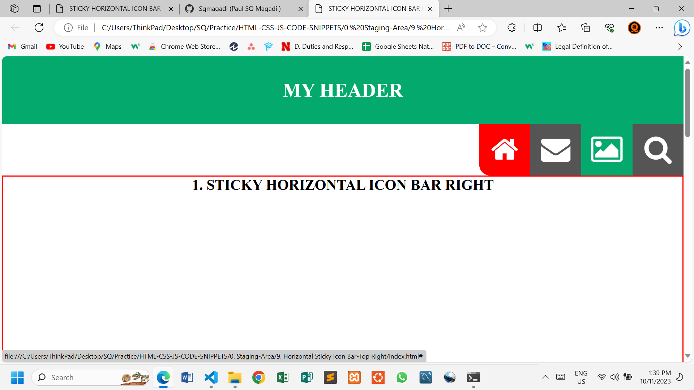
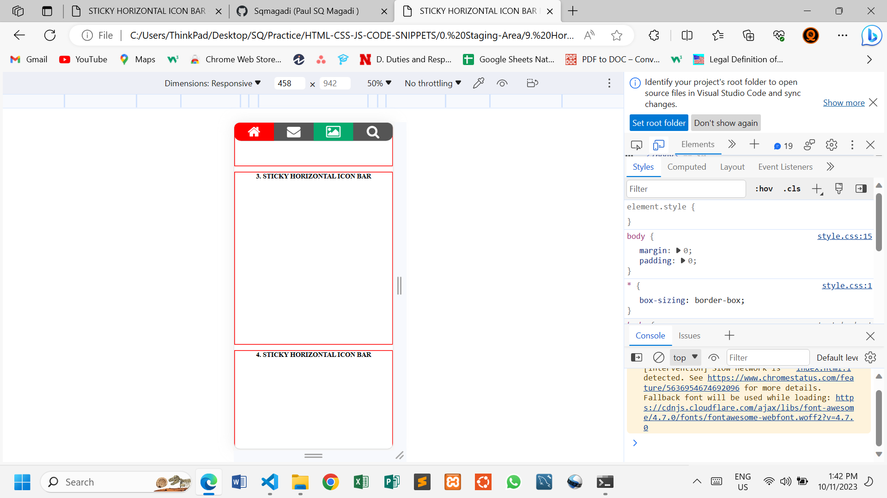

# STICKY TOP HORIZONTAL ICON BAR - RIGHT

This simple web page demonstrates how to make a Responsive Horizontal Icon Bar using HTML and CSS.

## HTML Structure

The icons are imported from **font awesome** with a link placed in the header section of the HTML file.

```html
<head>
    <link rel="stylesheet" href="https://cdnjs.cloudflare.com/ajax/libs/font-awesome/4.7.0/css/font-awesome.min.css">
</head>
```

## CSS

A simple style is added to give a better look.

The Icon Bar is kept at a Sticky position with: `position: sticky;` when `top: 0;`.

The bar is pushed to the right: `float: right;` .

```css
.icon-bar {
    width: 30%;
    background-color: var(--gray-color);
    overflow: auto;
    position: sticky;
    float: right;
    top: 0;
    border-bottom-left-radius: 20px;
}
```

Bar items floats from left to right with a width of 25% each.

```css
    .icon-bar a {
    font-size: 3rem;
    color: var(--white-color);
    width: 25%;
    float: left;
    text-align: center;
    padding: .3em 0;
    float: left;
}
```

We use `clear: right;` in **h2** so that the content of **h2** sits bellow the icon bar and not side by side.


## Solution



**STICKY**


### Break Point

A media query is used to lower the font sizes in smaller screens.

The bar also gets to 100% width.

The header is also removed.

```css
@media (max-width: 680px) {
    html {
        font-size: 13px;
    }

    header {
        display: none;
    }

    .icon-bar {
        width: 100%;
        border-bottom-right-radius: 20px;
    }

    .icon-bar a {
        padding: 0.1em 0;
    }
}
```



## Changes

Feel free to modify the HTML and CSS files to suit your needs.

## Author

@SQCODES

## License

This project is free for use any where. You do not need to get any permission to use it.